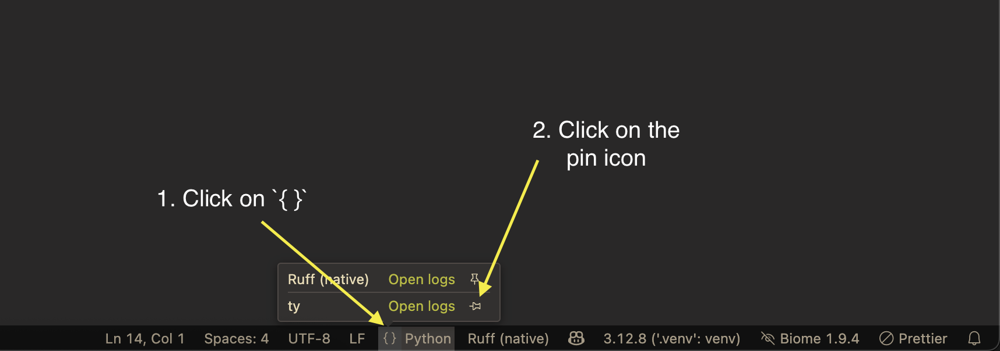

# ty extension for Visual Studio Code

[](https://pypi.python.org/pypi/ty)
[](https://pypi.python.org/pypi/ty)
[](https://github.com/astral-sh/ty-vscode/actions)

A Visual Studio Code extension for [ty](https://github.com/astral-sh/ty), an extremely fast
Python type checker and language server, written in Rust.

> [!WARNING]
>
> This extension uses the preview version of ty and is not ready for production use.
>
> We're working hard to make ty stable and feature-complete, but until then, expect to encounter bugs,
> missing features, and fatal errors.

The extension ships with `ty==0.0.1a2`.

## Features

Currently, the extension supports the following features:

- Showing diagnostics in the editor
- Hover type information for symbols
- Go to type definition
- Inlay hints for assignment targets
- [Completions](#completionsenable)

> [!NOTE]
>
> If you want to test the language server features like completions, go to type definition, etc., it's
> recommended to disable the language server from the [Python extension](https://marketplace.visualstudio.com/items?itemName=ms-python.python) (if installed) by adding the
> following [setting](https://code.visualstudio.com/docs/python/settings-reference#_intellisense-engine-settings) to your `settings.json`:
>
> ```json
> {
>   "python.languageServer": "None"
> }
> ```

## Usage

Once installed in Visual Studio Code, ty will automatically execute when you open or edit a
Python or Jupyter Notebook file.

If you don't want to use ty for a specific workspace, [disable this extension](https://code.visualstudio.com/docs/editor/extension-marketplace#_disable-an-extension)
in VS code.

## Untrusted Workspace

The extension supports [untrusted workspace](https://code.visualstudio.com/docs/editor/workspace-trust).
For untrusted workspaces, the extension always uses the bundled ty executable, ignoring the following settings:

- [`ty.importStrategy`](https://github.com/astral-sh/ty/blob/main/docs/reference/editor-settings.md#importstrategy)
- [`ty.interpreter`](https://github.com/astral-sh/ty/blob/main/docs/reference/editor-settings.md#interpreter)
- [`ty.path`](https://github.com/astral-sh/ty/blob/main/docs/reference/editor-settings.md#path)

## Settings

See [settings](https://github.com/astral-sh/ty/blob/main/docs/reference/editor-settings.md) for an enumeration of all supported settings.

## Commands

| Command              | Description                                  |
| -------------------- | -------------------------------------------- |
| ty: Restart server   | Restart the ty language server               |
| ty: Show client logs | Open the "ty" output channel                 |
| ty: Show server logs | Open the "ty Language Server" output channel |

## Requirements

This extension requires a version of the VSCode Python extension that supports Python 3.8+. ty
itself is compatible with Python 3.8 to 3.13.

## Getting help

If you encounter any issues with the extension or the language server, please refer to the
logs in the corresponding output channel in VS Code. The extension logs are in the "ty"
output channel and the language server logs are in the "ty Language Server" output channel.

To open the output panel, use the `Output: Show Output Channels` command in the command palette
(`Ctrl+Shift+P` or `Cmd+Shift+P`), then select "ty" or "ty Language Server". Alternatively,
you can use the `ty: Show client logs` and `ty: Show server logs` command to open the "ty"
and "ty Language Server" output channel respectively.

The default log level for the extension is `info` which can be changed from the output panel using
the settings icon in the top right corner of the panel.

The default log level for the language server is `info` which can be changed using the `ty.logLevel`
setting in your `settings.json`:

```json
{
  "ty.logLevel": "info"
}
```

The language server logs can be directed to a file by setting the `ty.logFile` setting in
your `settings.json`:

```json
{
  "ty.logFile": "/path/to/ty.log"
}
```

To capture the LSP messages between the editor and the server, set the `ty.trace.server`
setting to either `messages` or `verbose` in your `settings.json`:

```json
{
  "ty.trace.server": "messages"
}
```

This will be visible in the "ty Language Server Trace" output channel. The difference between
`messages` and `verbose` is that `messages` only logs the method name for both the request
and response, while `verbose` also logs the request parameters sent by the client and the
response result sent by the server.

The extension also displays certain information in the status bar. This can be pinned to the status
bar as a permanent item.

<details><summary><b>How to pin the ty status item in VS Code toolbar?</b></summary>

</details>

The status bar item displays the status of the language server. It can also be
clicked to open the ty output channel.

## License

The ty extension is licensed under the MIT license ([LICENSE](LICENSE)).

<div align="center">
  <a target="_blank" href="https://astral.sh" style="background:none">
    
  </a>
</div>
