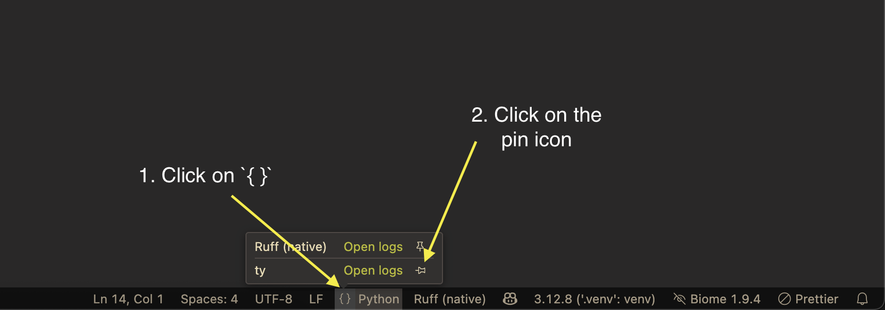

# Troubleshooting ty extension and the language server

This document describes how to troubleshoot issues with the ty extension or the
language server in Visual Studio Code.

## Logs

If you encounter any issues with the extension or the language server, please refer to the
logs in the corresponding output channel in VS Code. The extension logs are in the "ty"
output channel and the language server logs are in the "ty Language Server" output channel.

To open the output panel, use the `Output: Show Output Channels` command in the command palette
(`Ctrl+Shift+P` or `Cmd+Shift+P`), then select "ty" or "ty Language Server". Alternatively,
you can use the `ty: Show client logs` and `ty: Show server logs` command to open the "ty"
and "ty Language Server" output channel respectively.

The default log level for the extension is `info` which can be changed from the output panel using
the settings icon in the top right corner of the panel.

The default log level for the language server is `info` which can be changed using the `ty.logLevel`
setting in your `settings.json`:

```json
{
  "ty.logLevel": "info"
}
```

The language server logs can be directed to a file by setting the `ty.logFile` setting in
your `settings.json`:

```json
{
  "ty.logFile": "/path/to/ty.log"
}
```

To capture the LSP messages between the editor and the server, set the `ty.trace.server`
setting to either `messages` or `verbose` in your `settings.json`:

```json
{
  "ty.trace.server": "messages"
}
```

This will be visible in the "ty Language Server Trace" output channel. The difference between
`messages` and `verbose` is that `messages` only logs the method name for both the request
and response, while `verbose` also logs the request parameters sent by the client and the
response result sent by the server.

## Status bar

The extension also displays certain information in the status bar. This can be pinned to the status
bar as a permanent item.

To pin the ty status item in the VS Code toolbar, follow these steps:
1. Click on the `{}` icon in Python's status item
2. Click on the pin icon next to the "ty" section in the menu



The status bar item displays the status of the language server. It can also be
clicked to open the ty output channel.
